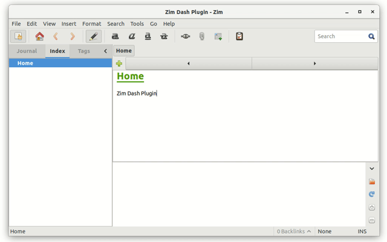

# Zim Dash Plugin

This plugin opens a search dialog to allow quickly executing menu entries.



# Usage

The dialog can be opened by pressing ```alt+x``` on your keyboard.
Previously selected entries can be cycled through using
```ctrl+TAB``` or ```ctrl+shift+TAB```.

# Setup

1. Put the `dash.py` into the plugins folder `~/.local/share/zim/plugins/` in Linux.
2. Enable the plugin in Zim via `Edit > Preferences > Plugins` and check mark the `Dash` plugin.


