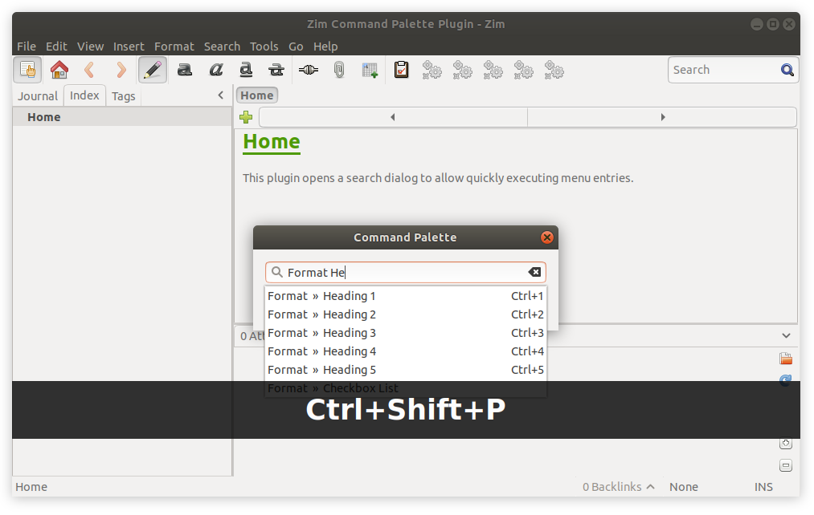

# Zim Command Palette Plugin

**Note:** This repository has been archived. Check out the official Zim Wiki Repository for the latest version of this plugin.

This plugin opens a search dialog to allow quickly executing menu entries.



# Usage

The dialog can be opened by pressing ```ctrl+shift+p``` on your keyboard.

# Setup

1. Put the `commandpalette.py` into the plugins folder `~/.local/share/zim/plugins/` in Linux.
2. Enable the plugin in Zim via `Edit > Preferences > Plugins` and check mark the `Command Palette` plugin.


